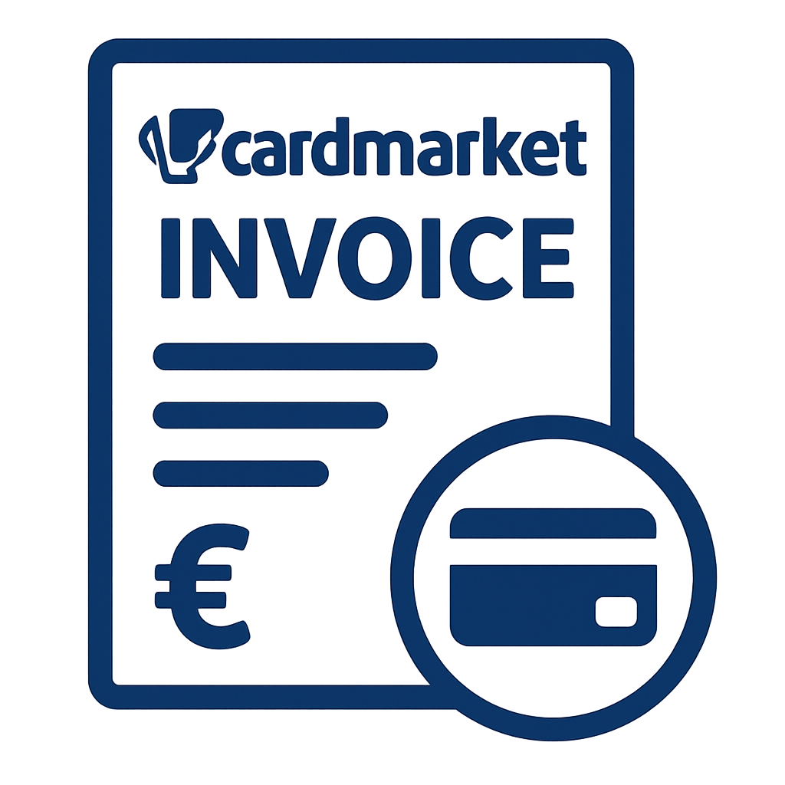

<!-- PROJECT LOGO -->
 

  

  <h3 align="center">CardmarkterInvoiceCreator</h3>

  

    A Chrome extension that can create an cutsom Invoice for Cardmarket

<!-- TABLE OF CONTENTS -->

  
Table of Contents

  <ol>
    <li>
      <a href="#about-the-project">About The Project</a>
    </li>
    <li>
      <a href="#getting-started">Getting Started</a>
      <ul>
        <li><a href="#installation">Installation</a></li>
      </ul>
    </li>
    <li><a href="#usage">Usage</a></li>
    <li><a href="#license">License</a></li>
  </ol>

<!-- ABOUT THE PROJECT -->
## About The Project

This Chrome extension streamlines the process of generating invoices from your Cardmarket sales orders. With a single click, it extracts order details directly from the Cardmarket order page and sends them to Invoice-Generator.com, returning a downloadable PDF invoice — complete with your custom logo and notes.

(<a href="#readme-top">back to top</a>)

<!-- GETTING STARTED -->
## Getting Started

This is an example of how you may give instructions on setting up your project locally.
To get a local copy up and running follow these simple example steps.

### Installation

_Below is an example of how you can instruct your audience on installing and setting up your app. This template doesn't rely on any external dependencies or services._

(<a href="#readme-top">back to top</a>)

<!-- USAGE EXAMPLES -->
## Usage

Use this space to show useful examples of how a project can be used. Additional screenshots, code examples and demos work well in this space. You may also link to more resources.

(<a href="#readme-top">back to top</a>)

<!-- LICENSE -->
## License

Distributed under the GNU GENERAL PUBLIC LICENSE. See `LICENSE.txt` for more information.

(<a href="#readme-top">back to top</a>)

